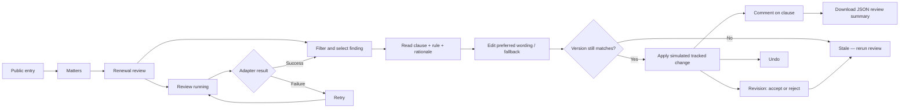
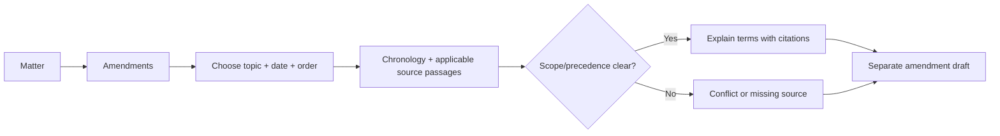
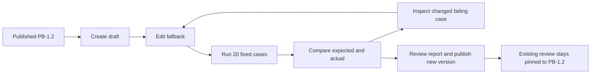

# ClauseForge — UX flow and screen design

Version 1.0 · 7 September 2026 · M1 composition + full-release flows

## Visual source of truth
The product designs now live on [Paper — Product / Library compositions](https://app.paper.design/file/01M1Y9JR3R892E2XYSNKZJA66N/6-0). See design/PRODUCT_PAGES.md and design/product-pages.json for all 26 artboards, 45 state specimens, source-component lineage and control contracts. Existing Paper library nodes were duplicated into the product pages and adapted; the original libraries remain intact. This supersedes the earlier code-first visual composition. The primary-page implementation now follows these components. See design/IMPLEMENTATION_MAP.md for functional adaptations and remaining parity checks.

## Information architecture and route/state map
| Hash route | Screen | Main action / state |
|---|---|---|
| #/ | Public entry | Open sample; explain simulated capabilities |
| #/matters | Matters | Search; open MAT-001; no results |
| #/review | Review MAT-001 | Topic/disposition filters, issue detail and anchored document |
| #/documents | Matter source set | Read-only source excerpts |
| #/activity | Activity | Review/mutation/comment/download events |
| #/amendments | Amendment explorer | Topic/date/order and cited scope; separate draft |
| #/playbooks | Playbook library | Published snapshots and draft editor |
| #/tests | Evaluation suite | Run, cancel, compare and inspect 20 fixture cases |

Unknown route displays a recovery screen with a working return link. Views keep domain state in the root; navigation does not reset edits. Browser storage is explicitly browser-local.

## Journey 1 — review (M1 kickoff)

## Workspace layout
Paper defines the current visual layout: editor header with matter/save/review/export controls; 280px outline; flexible white page with 24px corners and 64px padding; 320px findings inspector. The document uses Inter 24/32 title and 16/26 body from the editor library. Landing uses the floating navigation, centered Georgia headline and soft CTA from the landing library.

At 1280px the outline is 220px and page padding 40px. The 768px tablet reading frame places a compact outline above the document, uses 28px page padding and opens findings separately. Full-height Paper frames show scrolling content. See the dedicated applied-revision frame, revision/comment panel, export dialog and exception dialog.

## Interaction detail
| Trigger | Visible response | Mutation | Failure/recovery |
|---|---|---|---|
| Select finding | Highlight clause and scroll it into view | selection only | Missing source disables apply (M2 full variant) |
| Type proposal | Preview field changes, source unchanged | draft wording | Blank rejected inline |
| Apply | Del/ins appear; pending revision row; applied badge | guarded command | stale message and rerun |
| Dismiss | Reason is required and disposition changes | no document mutation | empty reason rejected |
| Accept/reject | Revision becomes resolved; finding stale | text/revision mutation | nonpending no-op |
| Add comment | Comment appears under clause | anchored comment | blank disabled |
| Undo | Prior text and dispositions restored | document snapshot restoration | disabled if empty stack |
| Run review | Busy label and disabled duplicate run | findings only | explicit test-failure option and retry |
| Download | JSON file; activity entry | no document edit | show that DOCX is pending M4 |
| Reset | Canonical sample replaces local demo work | scoped browser state | clearly labelled reset action |

## Journey 2 — amendments (M2)

Keep date/order selections while opening source. Show DOC-A2 payment override only for OF-2025. Renewal is not assumed to inherit it. Conflicts remain unresolved until explicit evidence or user resolution is recorded.

## Journey 3 — playbook regression (M3)

## Required state coverage by milestone
M1: populated, no filter results, proposed, edited, applied, dismissed, stale, pending/resolved revision, busy, failure/retry, browser-save error, undo unavailable. M2 adds new matter/upload, processing, no findings, partial job failure, missing anchors, exception approval and source conflicts. M3 adds rule validation, unsaved draft, cancelled/error/completed tests and published version. M4 adds compatibility/export failure. These are explicit gaps, not finished frames.

## Accessibility and review checklist
Tab order follows header → outline → document actions → issue filters and proposal. Native controls with labels; selected issue uses aria-pressed; route tabs use aria-current. Focus stays in proposal while typing. Status changes use a live region. Reviewer can select/apply/comment using keyboard. Test narrow layouts, long rule names, empty states and browser navigation. Confirm evidence/wording with Ricardo before public release.

## Additional implemented routes
#/matters/new, #/setup, #/amendments/draft, #/playbooks/edit, #/tests/results. The published-version query on the editor opens a read-only snapshot. Export, exceptions, revisions and optional assistant use native dialogs with focus restoration. Tablet findings use a separate dialog. Uploads are metadata-only; no real DOCX or AI capability is implied.
